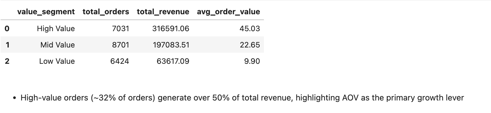
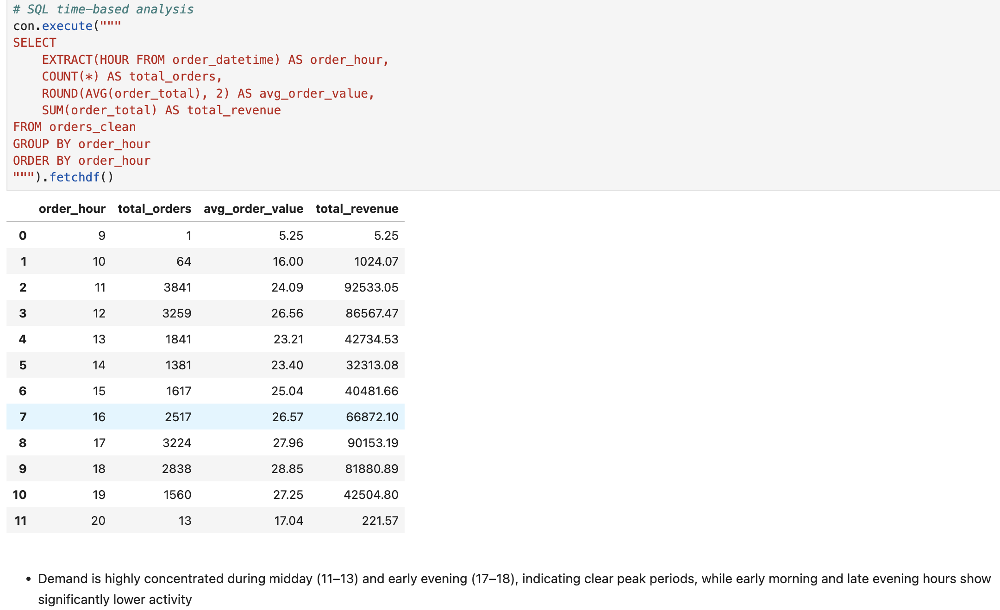
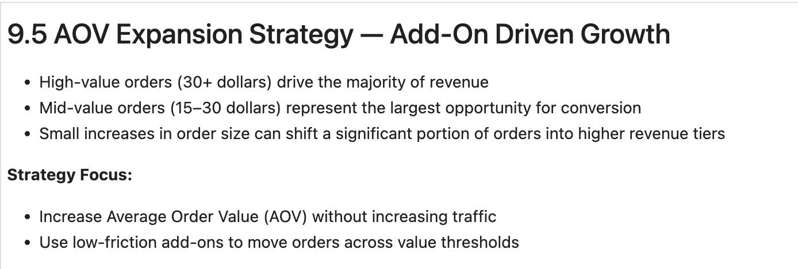
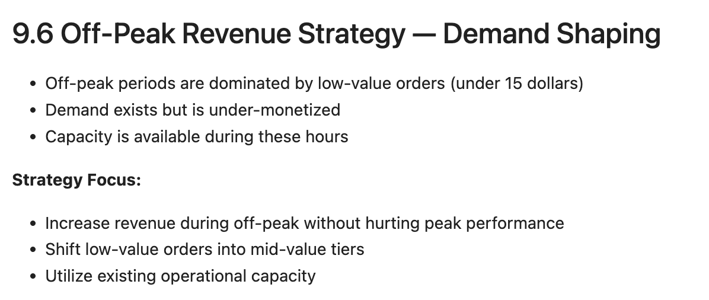
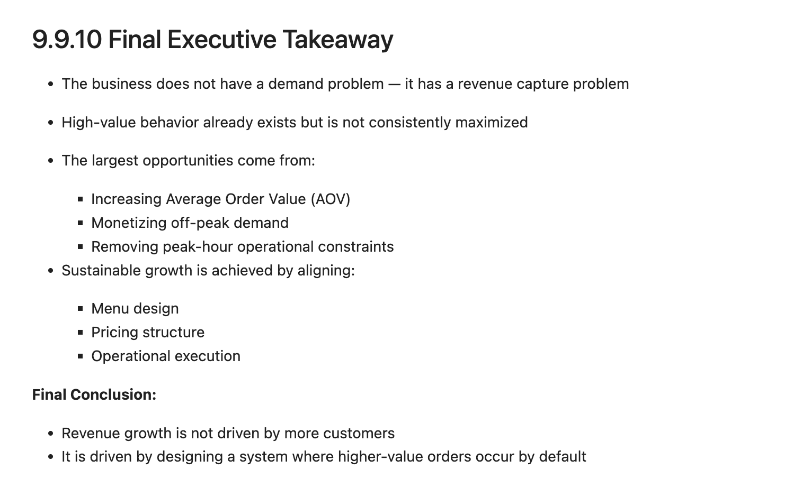

# 🍽️ Restaurant Revenue Optimization System

### End-to-End Data Analytics → Revenue Strategy → Execution System

---

## 🚀 Start Here

If you're reviewing this project:

1. Start with **Owner Strategy Playbook (Workbook 10)** → What to do
2. Then **Executive Report (Workbook 9)** → Why it works
3. Then **Revenue Drivers (Workbook 5)** → Core insight (AOV)

This project is designed as a **complete revenue system**, not a single notebook.

---

## 📊 Business Problem

Most restaurants try to grow revenue by:

* Increasing customer traffic
* Running discounts
* Expanding marketing

**This project tests a different approach:**

> Revenue growth can be achieved **without increasing traffic**
> by improving how each order captures value.

---

## 🔍 Key Insights

### 💰 Revenue is Driven by a Small Number of Items

* A small group of menu items generates the majority of revenue
* Core entrees and add-ons (e.g., cheese dip) drive performance
* Highlights opportunity to simplify the menu and promote top items

---

### 💵 Order Value (AOV) Drives Revenue Growth

* High-value orders generate the majority of revenue
* Mid-value orders represent the largest growth opportunity
* Low-value orders dominate volume but contribute minimal revenue

> **Insight:** Increasing AOV has greater impact than increasing traffic

---

### ⏰ Demand is Time-Concentrated

* Demand peaks during midday and early evening
* Off-peak hours show underutilized capacity

---

### 📈 Demand is Predictable

* Revenue trends are stable and forecastable
* Enables planning for staffing and operations

---

## 💡 Strategy Layer

### 🧀 AOV Expansion (Primary Lever)

* Introduce high-margin add-ons (cheese dip, drinks)
* Use threshold-based nudging (e.g., 25 → 30)
* Convert mid-value orders into high-value orders

---

### 🕒 Off-Peak Revenue Optimization

* Off-peak demand exists but is under-monetized
* Introduce meal-style ordering and light incentives
* Increase revenue without increasing labor cost

---

### 🍽️ Menu & Digital Ordering Optimization

* Restructure menu to prioritize meals over single items
* Surface add-ons (cheese dip, drinks) during ordering
* Optimize online ordering flow (Toast / delivery apps)

> Even without changing the physical menu, optimizing digital ordering increases AOV

---

### 🧠 Final Executive Insight

> The business does not have a demand problem —
> it has a **revenue capture problem**

---

## 🧾 Owner Strategy Playbook (Workbook 10)

This project concludes with a **non-technical execution layer**:

* What to change on the menu
* How to structure online ordering
* How to increase order size without adding customers

Key actions include:

* Promote meals instead of single items
* Attach add-ons to every order
* Optimize peak-hour throughput
* Monetize off-peak demand

---

## 🧱 System Design Thinking

This project is structured as a **layered analytics system**:

Data → KPIs → Behavior → Drivers → Forecast → Strategy → Execution

Unlike typical data projects:

* Not just dashboards
* Not just predictions

👉 Designed for **real business decisions**

---

## 📁 Project Structure

workbooks/
01_data_pipeline.ipynb
02_kpi_analysis.ipynb
03_demand_analysis.ipynb
04_business_strategy.ipynb
05_revenue_drivers.ipynb
06_forecasting.ipynb
07_experiments.ipynb
08_menu_strategy.ipynb
09_executive_report.ipynb
10_owner_strategy_playbook.ipynb

data/
cleaned/

visuals/
(project screenshots)

README.md

---

## 🧠 Skills Demonstrated

### 📊 Data Analysis

* SQL (DuckDB)
* Python (pandas)
* Data cleaning & transformation

### 📈 Analytics

* KPI development (Revenue, AOV, Volume)
* Time-series demand analysis
* Revenue segmentation

### 💡 Business Strategy

* AOV optimization
* Pricing strategy
* Menu engineering
* Demand shaping

### 🧱 System Thinking

* End-to-end analytics pipeline
* Translating data → decisions → execution
* Designing scalable revenue systems

---

## 🎯 Key Takeaways

* Revenue growth does not require more customers
* Increasing **Average Order Value (AOV)** is the most effective lever
* A small number of items drive most revenue
* Off-peak demand is the largest untapped opportunity
* Menu and ordering design directly influence customer behavior

---

## 🔥 Why This Project Stands Out

Most data projects:

* Analyze data
* Build models

This project:

* Identifies revenue drivers
* Designs business strategies
* Builds execution systems
* Connects data → operations → revenue

👉 Built to reflect **real-world business impact**

---

## 📌 Next Steps (Real-World Application)

* Implement AOV strategies in POS (Toast)
* Optimize online ordering flow
* Test off-peak promotions
* Track AOV and revenue lift over time

---

## 👤 Author

Fernando Romero
Data Analytics | Revenue Optimization | Systems Thinking
