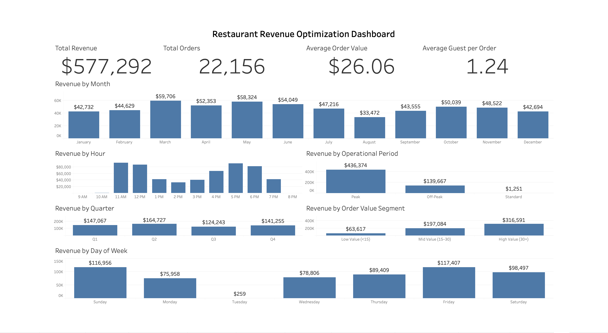
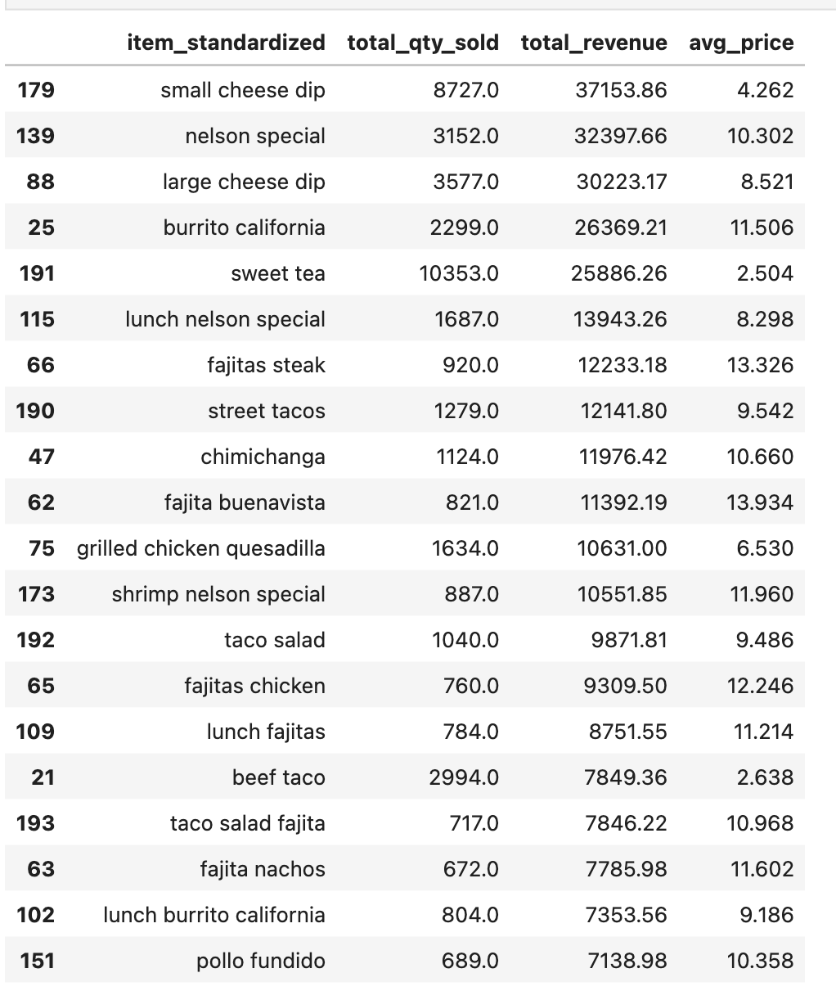
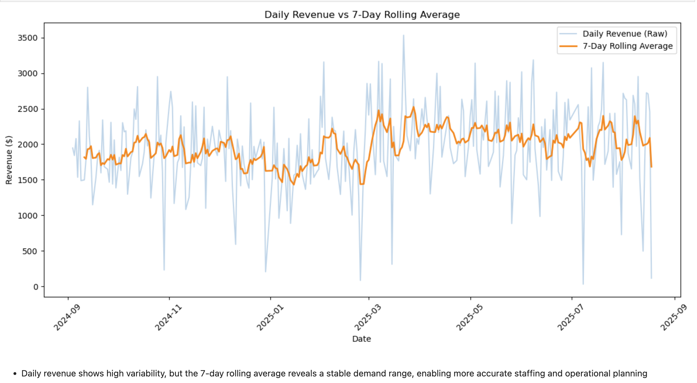

# 🍽️ Restaurant Revenue Optimization System

### End-to-End Data Analytics → Revenue Strategy → Business Intelligence

---

## 🚀 Start Here

If you're reviewing this project:

1. Explore the **Interactive Tableau Dashboard** for executive insights
2. Read the **Owner Strategy Playbook (Workbook 10)** → Recommended business actions
3. Review the **Executive Report (Workbook 9)** → Strategic recommendations
4. Dive into **Revenue Drivers (Workbook 5)** → Core AOV insights

This project is designed as a **complete revenue optimization system**, not a single notebook.

---

## 📊 Interactive Tableau Dashboard

### Restaurant Revenue Optimization Dashboard

**Tableau Public**

https://public.tableau.com/app/profile/fernando.romero4463/viz/restaurant_revenue_optimization_dashboard/RestaurantRevenueOptimizationDashboard



Dashboard highlights:

- Executive KPI scorecards
- Revenue trends by month
- Revenue by operational period
- Revenue by hour
- Revenue by order value segment
- Revenue by quarter
- Revenue by weekday

The complete Tableau workbook is also included:

```
visuals/dashboard/restaurant_revenue_optimization_dashboard.twbx
```

---

## 📊 Business Problem

Most restaurants try to grow revenue by:

* Increasing customer traffic
* Running discounts
* Expanding marketing

**This project tests a different approach:**

> Revenue growth can be achieved **without increasing traffic**
> by improving how each order captures value.

---

## 🔍 Key Insights

### 💰 Revenue is Driven by a Small Number of Items



* A small number of menu items and add-ons drive a disproportionate share of revenue
* Core entrees and add-ons (e.g., cheese dip) drive performance
* Highlights opportunity to simplify the menu and promote top items

---

### 💵 Order Value (AOV) Drives Revenue Growth


* High-value orders generate the majority of revenue
* Mid-value orders represent the largest growth opportunity
* Low-value orders dominate volume but contribute minimal revenue

> **Insight:** Increasing AOV has greater impact than increasing traffic.

---

### ⏰ Demand is Time-Concentrated


* Demand peaks during midday and early evening
* Off-peak hours show underutilized capacity

---

### 📈 Demand is Predictable



* Revenue trends are stable enough to support operational forecasting and staffing alignment
* Enables planning for staffing and operations

---

## 💡 Strategy Layer

### 🧀 AOV Expansion (Primary Lever)


* Introduce high-margin add-ons (cheese dip, drinks)
* Use threshold-based nudging (e.g., $25 → $30)
* Convert mid-value orders into high-value orders

---

### 🕒 Off-Peak Revenue Optimization


* Off-peak demand exists but is under-monetized
* Introduce meal-style ordering and light incentives
* Increase revenue without increasing labor cost

---

### 🍽️ Menu & Digital Ordering Optimization

* Restructure menu to prioritize meals over single items
* Surface add-ons (cheese dip, drinks) during ordering
* Optimize online ordering flow (Toast / delivery apps)
* Guide customers toward higher-value transactions through digital ordering design

> Even without changing the physical menu, optimizing digital ordering can significantly increase AOV.

---

### 🧠 Final Executive Insight


> The business does not have a demand problem—
> it has a **revenue capture problem.**

---

## 🧾 Owner Strategy Playbook (Workbook 10)

This project concludes with a **non-technical execution layer** focused on turning analytics into action.

Key recommendations include:

* Promote meals instead of single items
* Attach add-ons to every order
* Optimize peak-hour throughput
* Monetize off-peak demand
* Increase Average Order Value without increasing customer traffic

---

## 🧱 System Design Thinking

This project follows a layered analytics architecture:

```text
Data
   ↓
KPIs
   ↓
Behavior Analysis
   ↓
Revenue Drivers
   ↓
Forecasting
   ↓
Business Strategy
   ↓
Executive Execution
```

Unlike many portfolio projects, this system moves beyond visualization to provide actionable business recommendations.

---

## 📁 Project Structure

```text
workbooks/
│
├── 01_data_pipeline.ipynb
├── 02_kpi_analysis.ipynb
├── 03_business_analysis.ipynb
├── 04_business_strategy.ipynb
├── 05_revenue_drivers.ipynb
├── 06_forecasting.ipynb
├── 07_growth_experiments.ipynb
├── 08_menu_analysis.ipynb
├── 09_executive_report.ipynb
├── 10_owner_strategy_playbook.ipynb
└── 11_tableau_intelligence.ipynb

data/
└── orders_clean.csv

visuals/
├── analysis/
│   ├── workbook screenshots
│   └── strategy visuals
│
└── dashboard/
    ├── restaurant_revenue_optimization_dashboard.png
    └── restaurant_revenue_optimization_dashboard.twbx

README.md
```

---

## 🧠 Skills Demonstrated

### 📊 Data Analytics

* SQL (DuckDB)
* Python (pandas)
* Data cleaning & transformation
* Exploratory data analysis

### 📈 Business Intelligence

* Tableau Dashboard Development
* KPI design
* Executive dashboard development
* Interactive visualization

### 💡 Revenue Strategy

* Average Order Value optimization
* Pricing strategy
* Menu engineering
* Demand shaping
* Operational planning

### 🧱 Systems Thinking

* End-to-end analytics pipeline
* Translating data into business decisions
* Executive communication
* Revenue optimization system design

---

## 🎯 Key Takeaways

* Revenue growth does not require more customers.
* Increasing **Average Order Value (AOV)** is the strongest revenue lever.
* A small number of menu items generate most revenue.
* Off-peak demand represents the largest untapped opportunity.
* Menu and ordering design directly influence customer purchasing behavior.

---

## 🔥 Why This Project Stands Out

Most analytics portfolios:

* Analyze data
* Build dashboards
* Present findings

This project goes further by:

* Identifying revenue drivers
* Designing business strategies
* Building executive dashboards
* Creating implementation playbooks
* Connecting analytics, operations, pricing, and customer behavior into one revenue optimization system

This reflects how analytics creates measurable business value in real organizations.

---

## 📌 Next Steps (Real-World Application)

* Implement AOV strategies within Toast POS
* Optimize digital ordering flow
* Test off-peak promotional campaigns
* Measure long-term AOV and revenue lift
* Iterate based on dashboard KPIs

---

## 👤 Author

**Fernando Romero**

Data Analytics • Business Intelligence • Revenue Optimization • Systems Thinking
